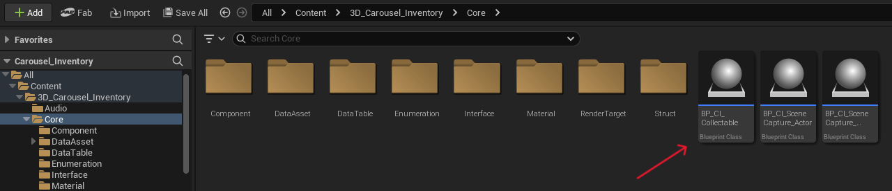
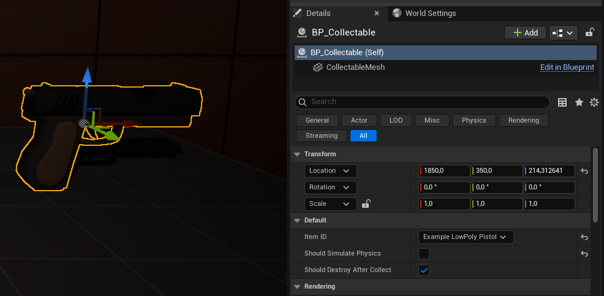

## 5 - Inside the Core folder, you will find BP_CI_Collectable. This will be the blueprint actor that should be used as a collectable in your project.

Place a BP_CI_Collectable on the game map and set the item ID in the details panel. Duplicate as many times as necessary, changing the ID of each item each time.

You can also configure whether this item should be destroyed after being placed and whether the mesh should simulate physics.