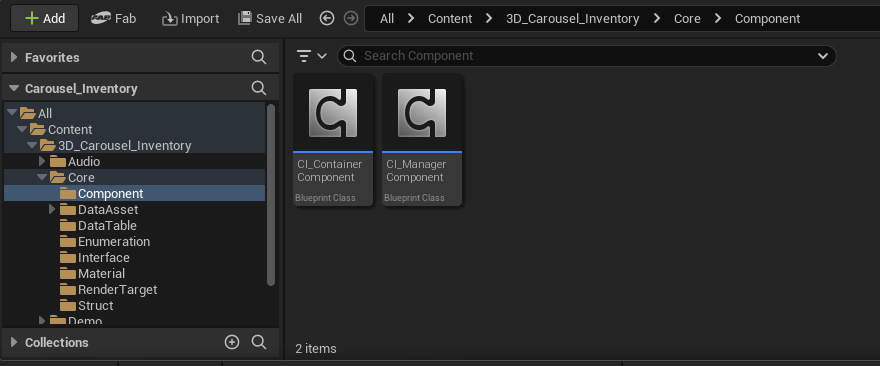
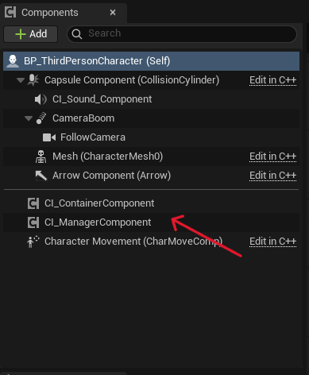

## 1 - Locate the 3D Carousel Inventory folder in your content drawer, then the Core and Components folders.

Inside the Components folder, you will find the two main components you need.

Simply add them to the components section of your player character.

