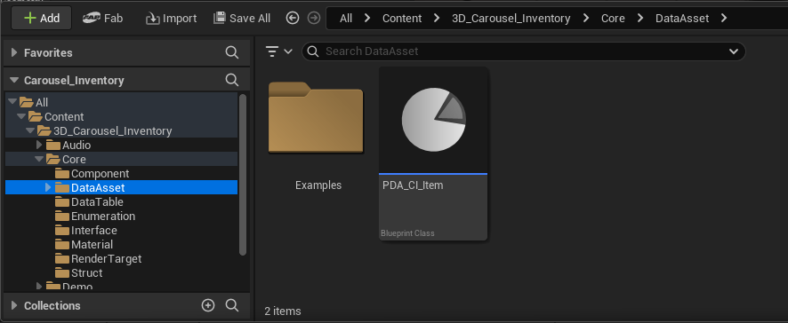
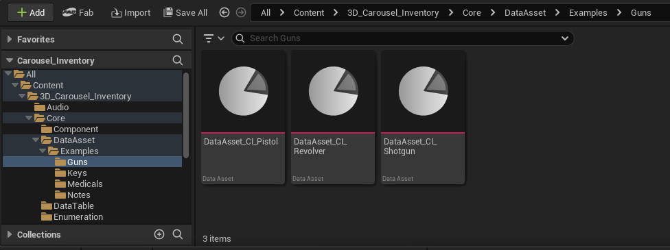
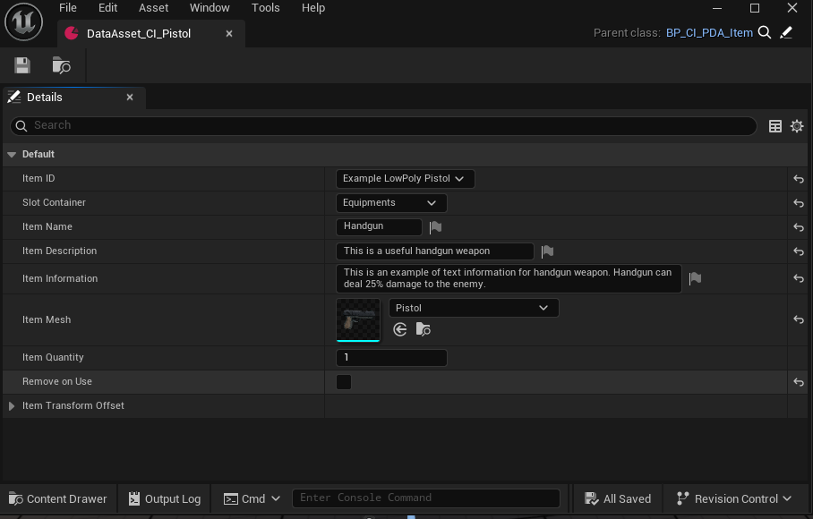

## 4 - Still in the Core folder, locate the DataAsset folder. You should create a data asset derived from BP_CI_PDA_Item for each item in your game and adjust the settings for each one.

The Asset already has some sample data assets configured according to the sample IDs in the enumeration. If you deleted them, you can delete the equivalent data assets.

All configuration options in the data asset are self-explanatory.

