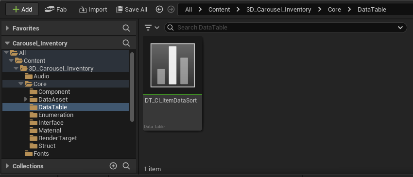
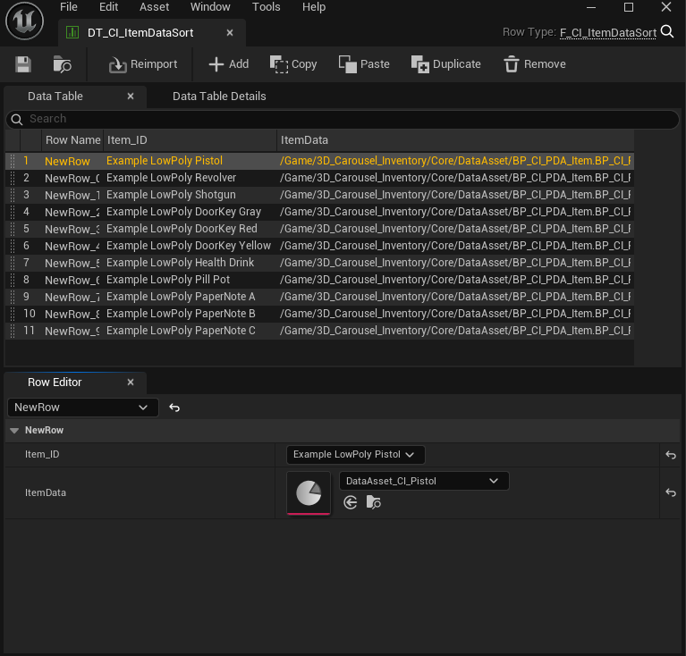

## 5 - Locate the DataTable folder inside the Core folder and the data table asset DT_CI_ItemDataSort.

You must add all items to this data table and configure each row appropriately. Simply pass the ID and corresponding data asset for each item.

