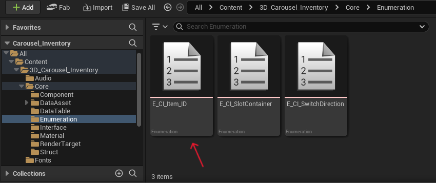
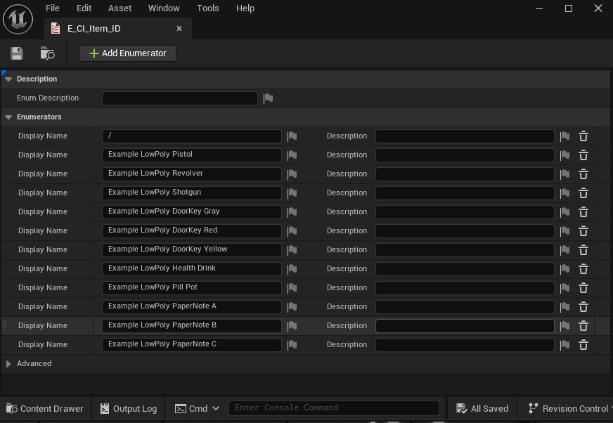

## 3 - Inside the Core folder, you will find the Enumeration folder and the E_CI_Item_ID enumeration. This is the enumeration needed to create all the IDs for each item in your project.

The asset already comes with some examples, you can delete them and add your own.

