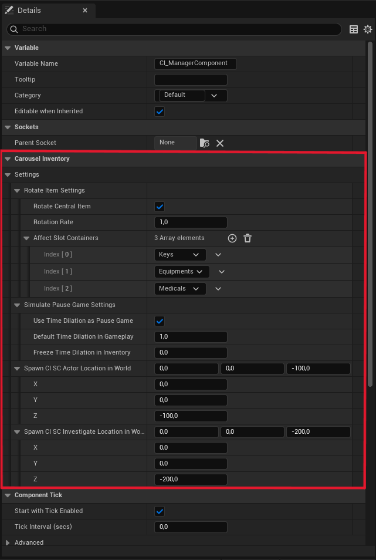
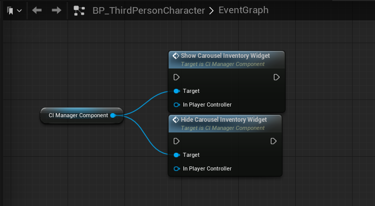

## 2 - In the details pane of the CI_ManagerComponent you will find the section settings. Here you can configure some initial aspects of the inventory functionality.

The names of each option are self-explanatory. In this feature, I use time dilation to simulate a pause game.
The CI SC InventoryScene and the CI SC InvestigateScene are the two main scene capture actors for the asset. Set an ideal location for both in the world.

To show or hide the inventory screen, you must call the functions contained in the component manager.

You can take a look at the sample project that comes with the asset. Open the ThirdPersonCharacter blueprint and see how it is configured to show and hide the widget.